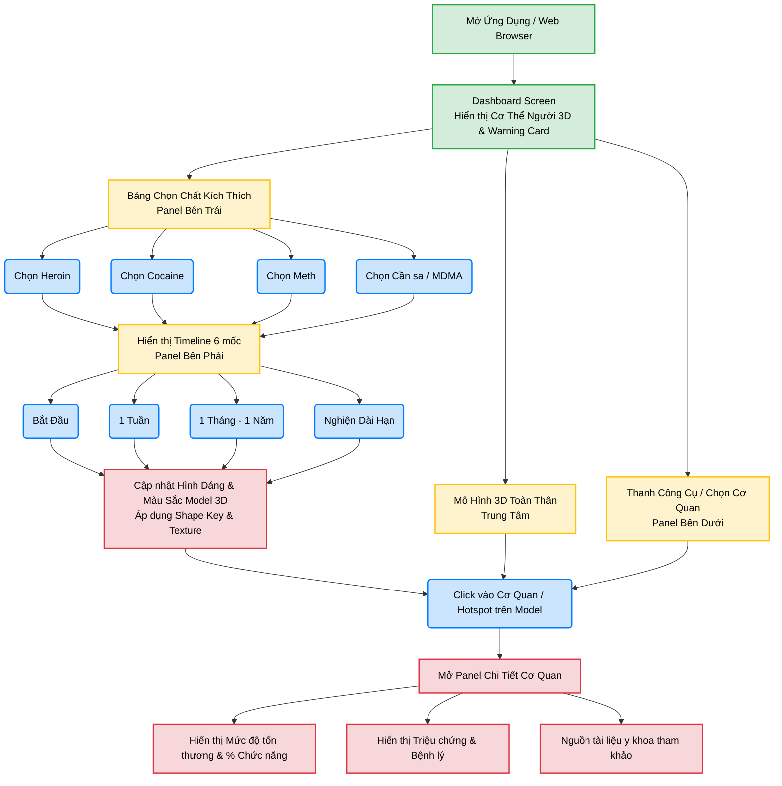

# User Interaction Flow - Human Bio Interactive 3D

Dựa trên cấu trúc của file `PROJECT_ANALYSIS.md` và giao diện tham khảo từ các file PPTX (UI 3D WEB), đây là luồng tương tác màn hình chính của người dùng (tương tự như cấu trúc mindmap bạn đã cung cấp).

### Ghi chú chức năng:
- **Dashboard Screen**: Giao diện chính duy nhất (Single Page Application). Mọi tương tác đều diễn ra ở đây để giữ trải nghiệm 3D liền mạch.
- **Tương tác cốt lõi**: `Chọn Thuốc` ➔ `Chọn Thời Gian` ➔ `Chọn Cơ Quan`.
- Mọi thao tác đều dẫn đến việc **cập nhật trực quan** trên mô hình 3D (đổi màu, biến dạng) trước khi người dùng cần phải đọc text chi tiết.
