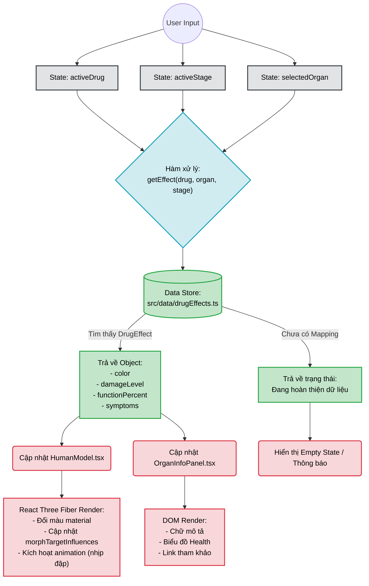

# System Data Processing Flow - Human Bio Interactive 3D

Biểu đồ này mô tả cách luồng dữ liệu (Data Flow) chạy ngầm bên dưới ứng dụng, từ thao tác của người dùng đến khi phản hồi lại trên màn hình. Được trích xuất từ cấu trúc React + Vite trong `PROJECT_ANALYSIS.md`.

### Giải thích:
- Kiến trúc đi theo hướng **Unidirectional Data Flow** của React.
- Mọi tương tác làm thay đổi State trung tâm (`App.tsx`).
- Việc lấy dữ liệu hoàn toàn tĩnh (local file `drugEffects.ts`), giúp tăng tốc độ tải mà không cần Backend ở giai đoạn MVP.
- Thành phần Render được chia làm 2 mảnh rõ rệt: **3D Canvas (React Three Fiber)** và **HTML DOM (UI Panel)**.
